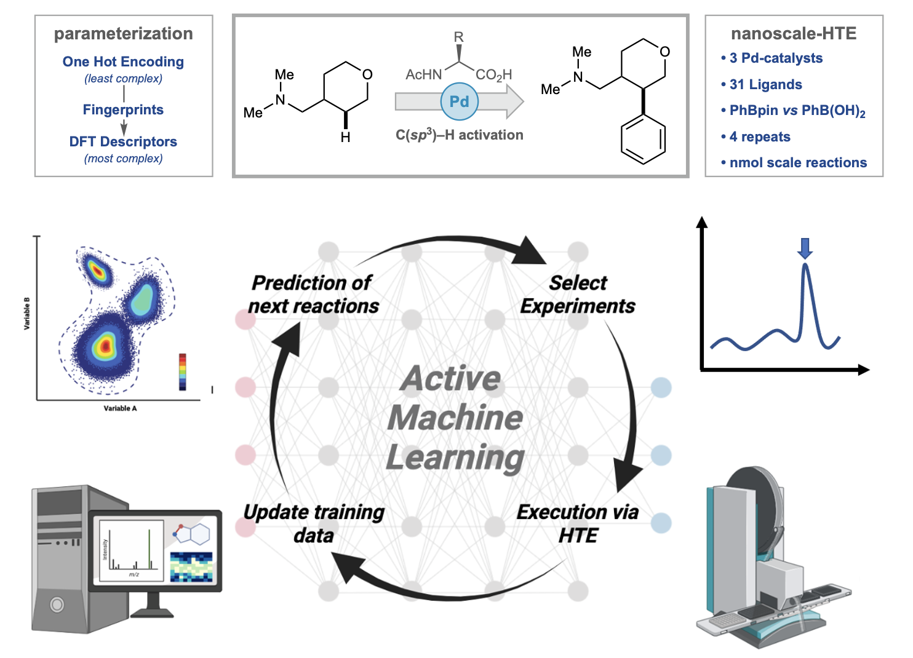

# The Effect of Chemical Representation on Active Machine Learning Towards Closed-Loop Optimization

Multivariate chemical reaction optimization involving catalytic systems is a non-trivial task due to the high number of tuneable parameters and discrete choices. Closed-loop optimization featuring active Machine Learning (ML) represents a powerful strategy for automating reaction optimization. However, the translation of chemical reaction conditions into a machine-readable format comes with the challenge of finding highly informative features which accurately capture the factors for reaction success and allow the model to learn efficiently. Herein, we compare the efficacy of different calculated chemical descriptors for a high throughput generated dataset to determine the impact on a supervised ML model when predicting reaction yield. Then, the effect of featurization and size of the initial dataset within a closed-loop reaction optimization was examined. Finally, the balance between descriptor complexity and dataset size was considered. Ultimately, tailored descriptors did not outperform simple generic representations, however, a larger initial dataset accelerated reaction optimization.

https://pubs.rsc.org/en/content/articlelanding/2022/re/d2re00008c

